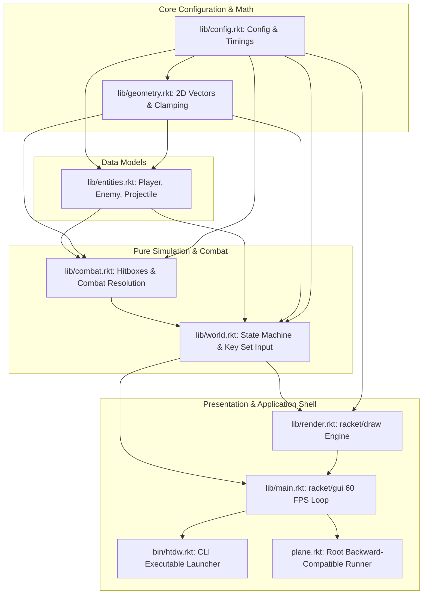

# Project Design Document: Htdw (Danmaku Shooter)

## 1. Executive Summary

**Htdw** is a 2D fixed-screen arcade/danmaku (curtain fire) shooter developed in modern, idiomatic [Racket](https://racket-lang.org/) adhering to modern game design patterns and Lisp project principles.

The codebase is built with zero educational library dependencies (completely free of `htdp` / `2htdp`), utilizing standard Racket systems:
- **Presentation & Canvas**: `racket/gui/base` with a fixed 60 FPS double-buffered game loop.
- **Rendering Context**: `racket/draw` (`dc<%>`) drawing offscreen bitmaps and sprites with high performance.
- **Core Simulation**: Pure, deterministic functional state transitions (`racket/base`, `racket/set`).

### Gameplay Concept & Theme
Featuring Touhou Project characters:
- **Player**: Marisa Kirisame (`assets/marisa.png`), an agile magician moving in 2D space who fires rapid magical projectiles upwards.
- **Enemy**: Cirno (`assets/cirno.png`), an ice fairy who periodically spawns and bounces horizontally across the upper screen.
- **Objective**: Evade enemies, eliminate them with focused magical fire, and survive to achieve maximum score.

---

## 2. Directory Layout & Architecture

The project is structured according to standard software engineering and Lisp conventions:

```
Htdw/
├── info.rkt                  # Package specification & dependencies
├── plane.rkt                 # Root convenience shim & full test runner
├── bin/
│   └── htdw.rkt              # Executable launcher script
├── lib/                      # Core engine and pure simulation modules
│   ├── config.rkt            # Configuration, timings, asset paths
│   ├── geometry.rkt          # 2D vector & coordinate math
│   ├── entities.rkt          # Immutable entity data structures
│   ├── combat.rkt            # Hitbox & combat resolution
│   ├── world.rkt             # World state machine & input set
│   ├── render.rkt            # Racket/draw rendering engine
│   └── main.rkt              # 60 FPS GUI application loop
├── assets/                   # Graphical assets
│   ├── marisa.png            # Player sprite
│   └── cirno.png             # Enemy sprite
└── doc/                      # Documentation
    └── DESIGN.md             # Project design document
```

### Module Dependency Flow



### Architectural Principles
1. **Zero HtDP Dependencies**:
   All educational teaching packages (`2htdp/image`, `2htdp/universe`, `#lang htdp/asl`) have been completely replaced with professional Racket foundation libraries (`racket/base`, `racket/gui/base`, `racket/draw`).
2. **Functional Core, Imperative Shell**:
   $$\text{WorldState}_{t+1} = \text{step}(\text{WorldState}_t)$$
   Game state is stored in immutable transparent structures. State progression is completely decoupled from rendering and clock sources, enabling effortless debugging, snapshotting, and regression testing.
3. **Modern Input Set Architecture**:
   Rather than relying on raw key-repeat events, the engine maintains an immutable `held-keys` set in the world state. The player's velocity vector is derived purely from the set of currently held keys, eliminating diagonal lockups, key-repeat delays, and missed release glitches.
4. **Decoupled Headless Testability**:
   Core modules contain self-contained `(module+ test ...)` suites executed via `raco test`. The entire simulation and offscreen renderer run headlessly in CI/CD without opening GUI windows.

---

## 3. Module Specifications

### 3.1 `info.rkt`
Declares package metadata, collection identity (`"htdw"`), and explicit dependencies (`"base"`, `"gui-lib"`, `"draw-lib"`, and `"rackunit-lib"`).

### 3.2 `lib/config.rkt`
Defines game parameters, timing, and asset paths using `define-runtime-path`:
- **Screen Dimensions**: $600 \times 800$ px
- **Frame Rate**: 60 FPS ($\approx 16$ ms tick)
- **Player Specs**: $26 \times 44$ px, radius 13 px, speed 6 px/frame, firing cooldown 6 frames ($\approx 10$ shots/sec)
- **Enemy Specs**: $44 \times 54$ px, radius 22 px, speed 4 px/frame, spawn cooldown 90 frames (1.5s)
- **Projectile Specs**: radius 5 px, speed 18 px/frame upwards

### 3.3 `lib/geometry.rkt`
Pure 2D vector mathematics library:
- Data structures: `(struct posn (x y))` and `(struct velocity (x y))`.
- Vector operations: `vec+`, `vec-`, `posn+vec`, `distance-sqr`, `distance`, `make-clamper`, and `in-bounds?`.

### 3.4 `lib/entities.rkt`
Defines immutable game entities:
- `player`: holds `velocity`, `pos`, and shot cooldown `cd`.
- `enemy`: holds `velocity`, `pos`, and hit points `hp`.
- `projectile`: holds `velocity`, `pos`, and `emitter` tag (`'player` or `'enemy`).
- Constructor and predicate utilities (`make-player`, `make-enemy`, `make-player-projectile`, `player-projectile?`).

### 3.5 `lib/combat.rkt`
Pure collision detection and combat resolution system:
- **Hitbox Geometry**: Circular collision detection using squared Euclidean distance:
  $$\Delta x^2 + \Delta y^2 < (r_1 + r_2)^2$$
- **Resolution Pipeline (`resolve-combat`)**:
  - Implemented via functional `for/fold`.
  - When a player projectile strikes an enemy:
    - The projectile is consumed.
    - The enemy takes damage (destroyed when $\le 0$).
    - Score is tallied and returned synchronously.

### 3.6 `lib/world.rkt`
Root state manager and world simulation step:
- **State Definition**:
  ```racket
  (struct world (player enemies projectiles enemy-spawn-cd points held-keys game-over?) #:transparent)
  ```
- **Input System**:
  - `world-key-down`: registers key into `held-keys` set.
  - `world-key-up`: removes key from `held-keys` set.
  - `compute-player-velocity`: derives $(v_x, v_y)$ vector from active keys (`WASD` and Arrow keys).
- **Simulation Pipeline (`world-step`)**:
  1. Computes player velocity from input set and clamps position to screen borders.
  2. Auto-fires projectiles on cooldown expiration.
  3. Moves projectiles and prunes off-screen entities.
  4. Spawns new enemies when cooldown expires and moves existing enemies with boundary bounce.
  5. Executes combat resolution via `combat.rkt`.
  6. Evaluates game-over conditions (player collision with enemy or projectile).

### 3.7 `lib/render.rkt`
Hardware-independent rendering engine built on `racket/draw`:
- Reads sprites once from `assets/` into cached `bitmap%` objects via `read-bitmap`.
- Operates on any `dc<%>` (allowing both screen drawing and headless bitmap rendering).
- Layers:
  1. Background clear with deep navy brush.
  2. Player and enemy projectiles.
  3. Enemy sprites centered at coordinates.
  4. Player sprite centered at coordinates.
  5. HUD displaying score at top center.
  6. Game Over semi-transparent overlay with restart prompt when defeated.

### 3.8 `lib/main.rkt`
Application entry point and GUI shell using `racket/gui/base`:
- Creates a fixed $600 \times 800$ `frame%` with automatic timer cleanup on close.
- Houses a custom `game-canvas%` utilizing double-buffering via an offscreen `bitmap%` to prevent flickering.
- Drives a 60 FPS `timer%` dispatching `world-step` and scheduling canvas repaints.
- Intercepts key release and restart triggers (`'r'` or `'return'`).

### 3.9 `bin/htdw.rkt` & `plane.rkt`
- `bin/htdw.rkt`: The command-line executable launcher.
- `plane.rkt`: Root facade that re-exports the modular API and runs tests or launches the game.

---

## 4. Current Status & Verification

| Module         | Location | Purpose                                           | Test Status           |
| -------------- | -------- | ------------------------------------------------- | --------------------- |
| `info.rkt`     | Root     | Package specification & dependencies              | Verified              |
| `config.rkt`   | `lib/`   | Gameplay constants, timings, asset paths          | Verified              |
| `geometry.rkt` | `lib/`   | Vector arithmetic, clamping, distance math        | 11 unit tests passing |
| `entities.rkt` | `lib/`   | Entity structs & constructors                     | Verified              |
| `combat.rkt`   | `lib/`   | Hitboxes, combat resolution, scoring              | 8 unit tests passing  |
| `world.rkt`    | `lib/`   | State step, input state, spawning, loss detection | 11 unit tests passing |
| `render.rkt`   | `lib/`   | Racket/draw offscreen rendering engine            | 2 unit tests passing  |
| `plane.rkt`    | Root     | Backward-compatible facade & test suite           | 32 unit tests passing |
| **Total**      |          | **Full Project Test Suite**                       | **64 tests passing**  |

---

## 5. Usage & Verification Commands

### Run Automated Headless Tests
```powershell
raco test plane.rkt
```
or across individual library modules:
```powershell
raco test lib/geometry.rkt lib/combat.rkt lib/world.rkt lib/render.rkt
```

### Launch Interactive Game
```powershell
# Executable launcher in bin/
racket bin/htdw.rkt

# Or via root shim:
racket plane.rkt
```
